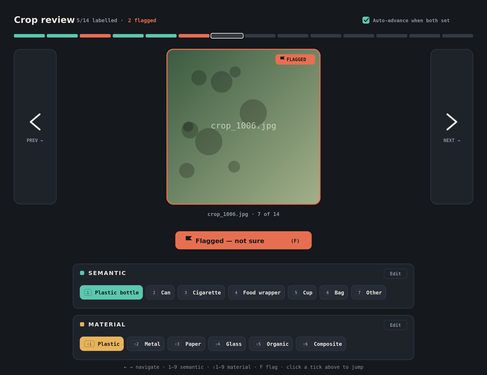

# TAG — Taxonomy Annotation Gateway

A browser-based image crop labelling tool built for reviewing and annotating whole image classification datasets.



## Features

- **Import** a flat or structured image folder; structured subfolders are detected as label suggestions
- **CSV import** — attach `filename, label` CSVs to create label groups; first row is always skipped as header
- **Multiple label groups** — each image can be labelled across independent groups (e.g. Material, Item Category, Brand...)
- **Suggested labels** — pre-imported labels shown as dashed pills; click to confirm
- **Confirm suggestions on navigate** — optionally auto-confirm suggestions when moving to the next image
- **Filters** — multi-select filter bar: All, Unlabelled, Flagged, or any label per group; filters combine with AND logic
- **Group exclusions** — per-label dropdown to exclude other groups from being required (e.g. "Some Litter items may not have a brand label")
- **Stats panel** — live per-group progress, label distribution, and export buttons
- **Export** — CSV or folder-structured zip, named `TAG-Export-{group}-{timestamp}.zip`
- **Zoom overlay** — click any image to open a full-screen pan/zoom viewer

## Stack

- React 19 + Vite
- Material UI v9
- JSZip

## Development

```bash
npm install
npm run dev
```

